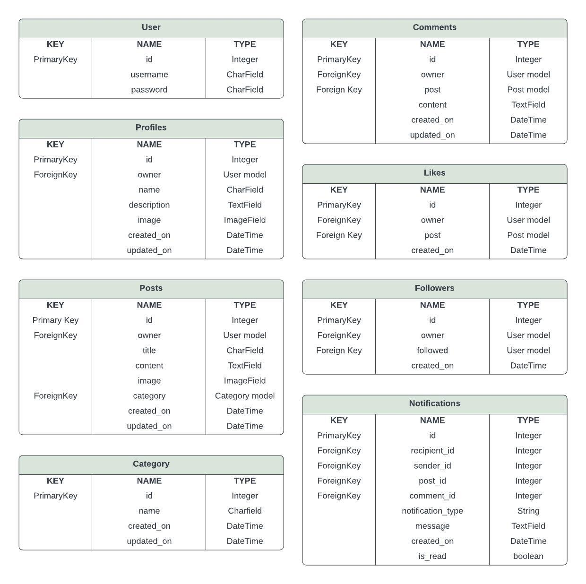
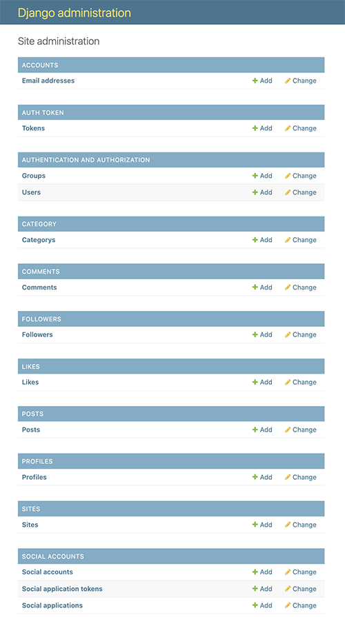

# FROM HOUSE TO HOME API

From House to Home API is a Django based web application for [From House to Home](https://github.com/rachaelbabister/from-house-to-home), designed for users to share their home improvement photos or inspirational photos. The API enables user authentication, profile management, leaving comments, liking other posts and following other users.

LIVE SITE

[You can view the live web application here.](https://from-house-to-home-b7afcfcc32e9.herokuapp.com/)

GITHUB PAGES

[You can view the API GitHub code pages here.](https://github.com/rachaelbabister/from-house-to-home-api) 
[You can view the Front-End GitHub code pages here.](https://github.com/rachaelbabister/from-house-to-home)

---

# **CONTENTS**

<!-- TOC -->

<!-- TOC -->

---

# **Planning**

## **User Stories**

Separate user stories were created for the API from those created for the front-end of the project, however they were all added to the same project board and separated using a different Epic called Backend. That way the whole development process was visible on the same board. You can view the user stories on [this project board](https://github.com/users/rachaelbabister/projects/4).

## **Data Models**

Various data models were drawn out before creating the actual models, to serve as a blueprint for database design, helping with concepts and organisation of the structure of a database.

\
*Data Models for From House to Home*

## **Relationships**

### User Profile:
- User (OneToOne): Each user has a user profile, establishing a OneToOne relationship. This ensures that each user has a single profile, and vice versa.

### Posts:
- User (OneToMany): Each post is created and uploaded by a user. This relationship indicates a OneToMany relationship, where one user can create multiple posts, but each post is associated with only one user.
- Category (ManyToOne): Each post can belong to a category (optional). This relationship indicates a ManyToOne relationship, where multiple posts can belong to the same category, but each post is linked to one one category.

### Comments:
- Recipe Post (OneToMany): Comments are associated with posts, following a OneToMany relationship. Each post can have multiple comments, but each comment is linked to only one post.
- User (OneToMany): Similarly, comments are posted by users, forming another OneToMany relationship. A user can write multiple comments, but each comment is linked to only one user.

### Likes:
- Post (OneToMany): Likes are associated with posts, following a OneToMany relationship. Each post can have multiple likes, but each like is linked to only one post.
- User (OneToMany): Similarly, likes are made by users, forming another OneToMany relationship. A user can like multiple posts, but each like is attributed to only one user.

### Followers:
- User (ManyToMany): Followers represent a ManyToMany relationship with users. A user can follow many users, and each user can be followed by many users.

### Notifications:
- User (ManyToOne): Each notification is associated with a single user, creating a ManyToOne relationship. A user can receive multiple notifications, but each notification is linked to only one user.
- Post (ManyToOne): This represents a ManyToOne relationship where each notification can be associated with a single post, but a post can generate multiple notifications.
- Comment (ManyToOne): This represents a ManyToOne relationship where each notification can be associated with a single comment, but a comment can generate multiple notifications.
- Like (ManyToOne):This represents a ManyToOne relationship where each notification can be linked to a single like, but a like can generate multiple notifications.
- Follower (ManyToOne): This represents a ManyToOne relationship where each notification can be associated with a specific follower, but each follower can generate multiple notifications.

---

## **Website Security**

### env.py File
- API keys and databases are stored in the env.py which is not included in version control to prevent exposure.

---

## **Features/Apps**

To explain the features of the API, it is easier to break them down by Apps. A short explanation of each app is detailed below.

### **Profiles**

When a user registers on the app, a Profile is automatically created for them. This can then be updated by the user should they wish.

**API Endpoints:**
- **/profiles/**: to list (GET) profiles.
- **/profiles/:id/**: to show (GET) or update (PUT) a profile.

### **Posts**

Posts can be viewed by any user, whether they are logged in or not. However, only registered users who are logged in can create, update and delete a post. 

Posts can be filtered and searched.

**API Endpoints:**
- **/posts/**: to list (GET) or create (POST) posts.
- **/posts/:id/**: to show (GET), update (PUT) or delete (DELETE) a post.

### **Category**

Categories are used to list posts in specific topics, to make it easier for a user to find posts related to that topic. A user can also select a category when creating a post, but they do not have the ability to create, update or delete categories.

**API Endpoints:**
- **/category/**: to list (GET) categories.

### **Comments**

Logged in users can engage with posts by leaving their own comments. Users are able to create, update and delete comments.

**API Endpoints:**
- **/comments/**: to list (GET) all comments or create (POST) a new comment.
- **/comments/:id/**: to show (GET) a specific comment, update (PUT) or delete (DELETE) a comment.

### **Likes**

Logged in users are able to like posts or other user profiles. Users are able to see their likes and delete them if they wish.

**API Endpoints:**
- **/likes/**: to list (GET) or create (POST) likes.
- **/likes/:id/**: to show (GET) or delete (DELETE) a like.

### **Followers**

Logged in users are able to follow and unfollow other users.

**API Endpoints:**
- /followers/: to list (**GET**) profiles.
- /followers/:id/: to show (**GET**) or delete (**DELETE**) a follow.

Django Admin screenshot for From House to Home

---

## **Testing**

---

## **Technologies & Packages

### **Main Technologies**

- JavaScript - for functionality.
- Django - a Python based framework for backend development.
- PostgreSQL from CI - a database to store all data.

### **Packages**

- **cloudinary==1.40.0 & django-cloudinary-storage==0.3.0** - Cloud based media hosting and storage.
- **dj-database-url==0.5.0** - Utility library for Django.
- **dj-rest-auth==2.1.9** - Authentication and registration endpoints for Django REST framework.
- **Django==4.2** - Python framework.
- **django-allauth==0.50.0** - User authentication, registration, and account management.
- **django-cors-headers==4.4.0** - Middleware Cross-Origin Resource Sharing (CORS) to allow requests from different domains.
- **django-filter==24.2** - Filter querysets in Django REST framework.
- **django-heroku==0.3.1** - Configures Django to run on Heroku by managing settings for Heroku deployment.
- **djangorestframework==3.15.2** - Toolkit for building Web APIs in Django.
- **djangorestframework-simplejwt==5.3.1** - Provides JSON Web Token (JWT) authentication for Django REST framework.
- **gunicorn==22.0.0** - A WSGI HTTP server for running Django applications in production.
- **oauthlib==3.2.2** - Implementation of OAuth for Python.
- **pillow==10.4.0** - Python Imaging Library.
- **psycopg2==2.9.9** - PostgreSQL adapter for Python.
- **PyJWT==2.8.0** - Python library for encoding and decoding JSON Web Tokens (JWTs).
- **python3-openid==3.2.0** - A library for OpenID authentication in Python 3.
- **pytz==2024.1** - A library for cross-platform timezone calculations.
- **requests-oauthlib==2.0.0** - OAuthlib integration for the Requests library.
- **sqlparse==0.5.1** - SQL statements library.
- **whitenoise==6.6.0** - Serves static files in production.

---

## **Deployment**

You can view the deployed API here: [From House to Home API](https://home-api-58bb6b7692c8.herokuapp.com/).
- [Admin page](https://home-api-58bb6b7692c8.herokuapp.com/admin)
- [Profiles](https://home-api-58bb6b7692c8.herokuapp.com/profiles)
- [Posts](https://home-api-58bb6b7692c8.herokuapp.com/posts)
- [Comments](https://home-api-58bb6b7692c8.herokuapp.com/comments)
- [Categories](https://home-api-58bb6b7692c8.herokuapp.com/category)
- [Likes](https://home-api-58bb6b7692c8.herokuapp.com/likes)
- [Followers](https://home-api-58bb6b7692c8.herokuapp.com/followers)

### **Environment & Settings**

- In your IDE open your env.py file or create one in the main directory if it hasn't been created for you.
- Having created your cloud-based database, add the DATABASE_URL value and a SECRET_KEY value to the env.py file.
- Open the settings.py file and import the env.py file and the DATABASE_URL and SECRETKEY file paths.
- Install Django and add to requirements.txt.
- Create your project.
- Add the STATIC files settings.
- Create a file called Procfile (with a capital P) in the main directory,
- For cloud-based image storage, add Cloudinary URL to env.py
- Add Cloudinary libraries to INSTALLED APPS.
- Add your IDE workspace and Heroku to ALLOWED_HOSTS.
- Make migrations and migrate.
- Create new Django project - *django-admin startproject <home_api>*.
- Create Superuser (email can be left blank) - *python manage.py createsuperuser (username>email>password1>password2)*.
- Create your apps - *python manage.py startapp <nameofapp>*.
- Before you add, commit & push your files to GitHub, ensure DEBUG is set to False in your settings.py file.

### **Deploying to Heroku**

- Login or create an account on Heroku.com. Click 'New' and then 'Create New App'.
- Give your project a unique name and select a region, then click 'Create App'.
- Connect your Heroku project to your GitHub repository. Under deployment you can choose GitHub, find the relevant one and click 'Connect.
- Once connected, go to the Settings tab and click on 'Reveal Config Vars'. Add the following:
  - CLOUDINARY_URL - copied URL from Cloudinary
  - DATABASE_URl - copied URL from PostGre
  - SECRET_KEY - a unique secret key
  - ALLOWED_HOST - with the value of your deployed Heroku application URL
  - DISABLE_COLLECTSTATIC - add 1 if this is to be disabled to prevent errors, or 0 if the app is in a state where errors will not be generated.
- Navigate to the Deploy section, click on Github for the deployment method and confirm.
- Search for your repository name and click connect.
- At the bottom of the deploy section, make sure you are connected to the main branch and then click Deploy Branch.
- You can then view your live site.

### **How to Fork**

To fork a repository on Github, follow these steps:

- Log in to Github - or step up a new account.
- Click on the repository name.
- Click the Fork button in the top right corner.

### **How to Clone**

To clone a repository on Github, follow these steps:

- Log in to Github - or step up a new account.
- Find or create your repository.
- Click on the code button, select whether you would like to clone with HTTPS, SSH or GitHub CLI and copy the link shown.
- Open the terminal in your code editor and change the current working directory to the location you want to use for the cloned directory.
- Type 'git clone' into the terminal and paste the link you copied in step 3. Press enter.